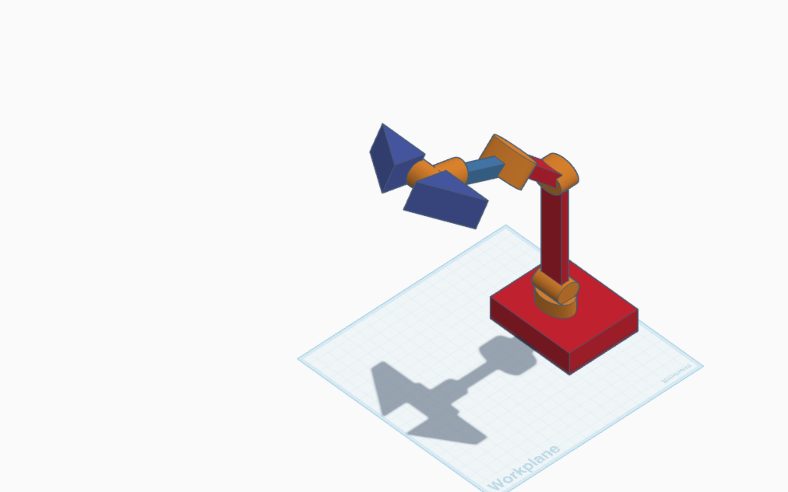

# 3D-robotic-arm-5DOF
This project about a 3D robotic arm with 5 degrees of freedom (5DOF) built using Tinkercad. 

**Degrees of Freedom:**
1. Base rotation
2. Shoulder movement
3. Elbow movement
4. Wrist lift
5. Wrist rotation

Figure 1: 3D robotic arm with 5DOF simulated in Tinkercad.

**Tinkercad Simulation**
You can explore the full 3D model and circuit simulation on Tinkercad:
[View the project on Tinkercad](https://www.tinkercad.com/things/gZP4z349YmY-3d-robotic-arm-5dof)

